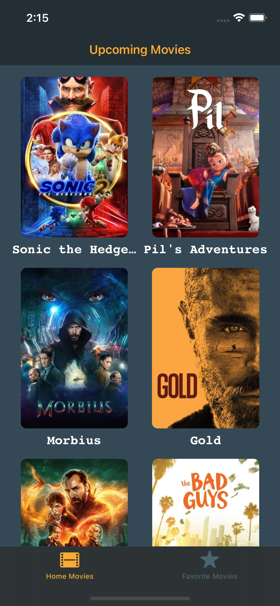
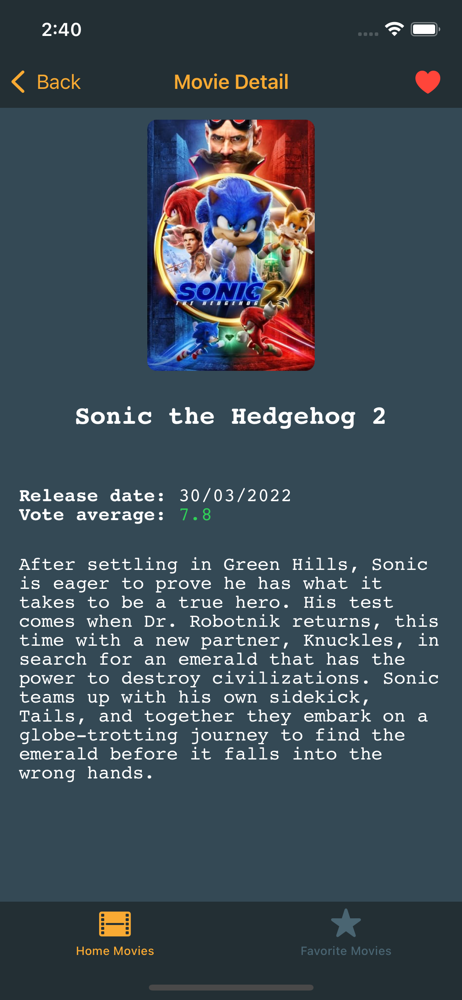
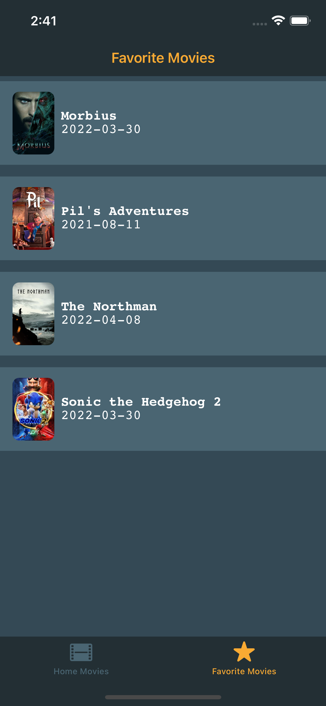
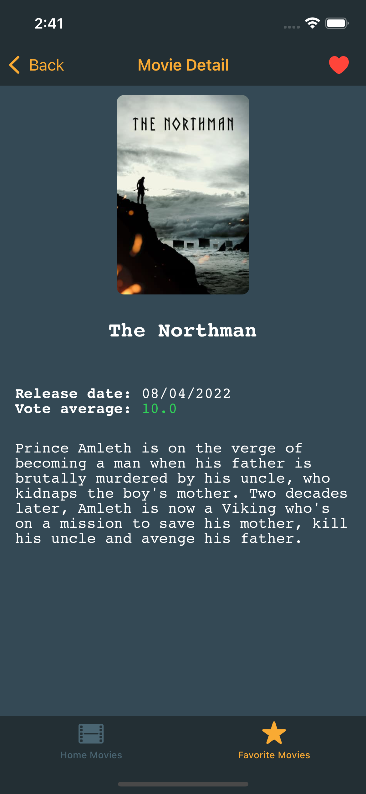

# ilia-ios-challenge

## Instruções:
- Crie um *fork* a partir desse repositório.
- Ao terminar o desafio abrir um *Pull Request* com a seguinte nomenclatura: <br>
<code>PR: ilia_ios_challenge_githubUserName</code>

## O desafio:
O aplicativo contido nesse repositório apresenta *bugs*, erros de lógica, código incompleto, inconsistência de UI.
O objetivo do desafio é fazer o app se comportar como o esperado fazendo as devidas correções. Todos os testes unitários que estão implementados devem obter sucesso. O comportamento esperado pode ser visto nas imagens e video em anexo.
Cada alteração no código deve ser precedida de um comentário explicando o porquê da alteração. Segue os tipos de comentários:

- ### **Inserção de código**
    Todo código novo que for adicionado no projeto.
```swift
    /*
        @INSERÇÃO
        A seguinte função foi criada para …
    */
```
- ### **Alteração de código**
    Todo código existente que for alterado no projeto.
```swift
    /*
        @ALTERAÇÃO
        A seguinte função foi alterada para …
    */
```
- ### **Deleção de código**
    Todo código que for deletado no projeto.
```swift
    /*
        @DELEÇÃO
        A seguinte função foi deletada pois …
        -> func loadMovies(page: Int) -> void (assinatura da função)
        -> var movies: [Movie] (assinatura da variável)
        -> class HomeMoviesViewModel: ObservableObject (assinatura da Classe)
    */
```
- ### **Sugestão de código**
    Não ocorreu nenhuma das ações anteriores, o desafiado apenas faz uma sugestão.
```swift
    /*
        @SUGESTÃO
        Nesse caso poderia ser usado …
    */
```

## Imagens:






## Video:
[Video do App](git-resources/screen_recording_app.mp4)